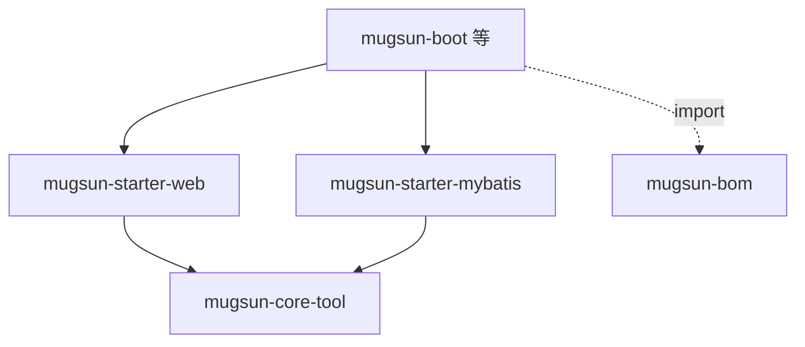

# mugsun-core

**中文** | [English](README_EN.md)


Mugsun 的公共内核：BOM 锁版本 + 两个 starter。业务工程 import BOM 后拿统一响应、全局异常、接口加解密和实体基类，不用每个项目重写一遍。

BOM 里把 `mybatis-spring` 固定到 3.0.5，避免 MyBatis-Flex 旧传递依赖和 Spring Boot 3.5 冲突。

## 模块

| 模块 | 职责 |
| --- | --- |
| `mugsun-bom` | 依赖版本锁定 |
| `mugsun-core-tool` | `R`、`ResultCode`、异常、工具类 |
| `mugsun-starter-web` | 全局异常、Sa-Token、接口加解密、Excel |
| `mugsun-starter-mybatis` | MyBatis-Flex、`BaseEntity` |



## 接入

```bash
mvn clean install
```

```xml
<dependencyManagement>
  <dependencies>
    <dependency>
      <groupId>com.mugsun</groupId>
      <artifactId>mugsun-bom</artifactId>
      <version>0.0.1-SNAPSHOT</version>
      <type>pom</type>
      <scope>import</scope>
    </dependency>
  </dependencies>
</dependencyManagement>

<dependencies>
  <dependency>
    <groupId>com.mugsun</groupId>
    <artifactId>mugsun-starter-web</artifactId>
  </dependency>
  <dependency>
    <groupId>com.mugsun</groupId>
    <artifactId>mugsun-starter-mybatis</artifactId>
  </dependency>
</dependencies>
```

## starter 提供什么

- **`R<T>`**：统一 `{code,success,data,msg}` 响应
- **异常映射**：401/403/400/404/405，500 可挂 `ErrorLogListener` 落库
- **Sa-Token**：`@SaCheckLogin` / `@SaCheckPermission`
- **接口加解密**：`@ApiDecrypt` / `@ApiEncrypt`，SM4-CBC
- **Long 精度**：超 JS 安全整数转字符串
- **`BaseEntity`**：雪花 ID、审计字段、逻辑删除；写入前 `sanitize*` 清伪造字段
- **`ExcelUtil`**：FastExcel 读写
- **`TreeUtil.build()`**：建树，遇环整段丢弃

## 约定

- Java 21，Tab 缩进
- 自动装配写在 `AutoConfiguration.imports`，不做组件扫描
- Bean 带 `@ConditionalOnMissingBean`，业务可覆盖

## 与 mugsun-boot

本仓不单独运行。[mugsun-boot](https://github.com/mugsun/mugsun-boot) import BOM 并引 starter。两仓平级放置即可联调。

提交信息见 [.github/COMMIT_CONVENTION.md](.github/COMMIT_CONVENTION.md)。

## Star History

[](https://star-history.com/#mugsun/mugsun-core&Date)

## 许可

[Apache License 2.0](LICENSE)
