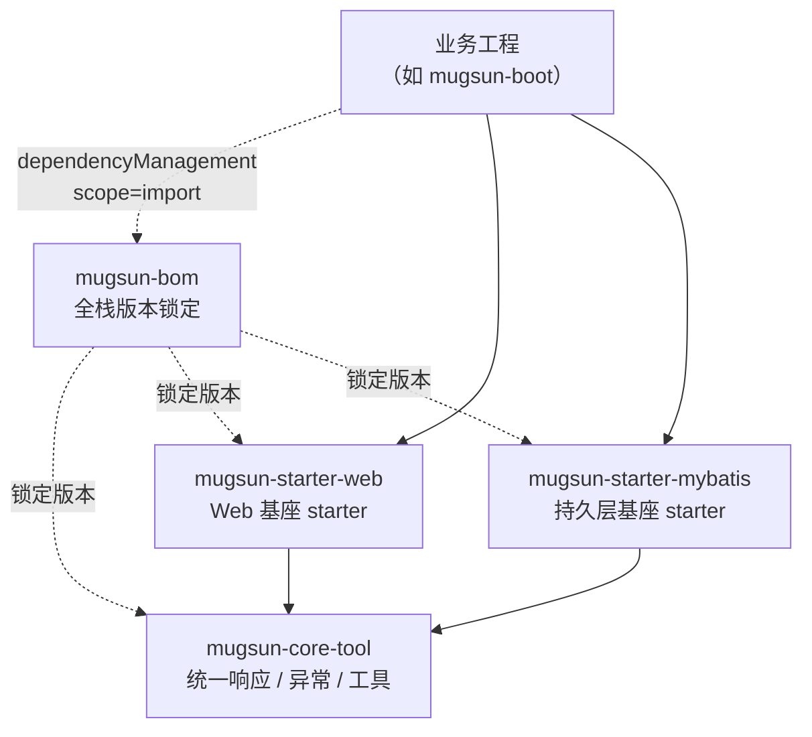
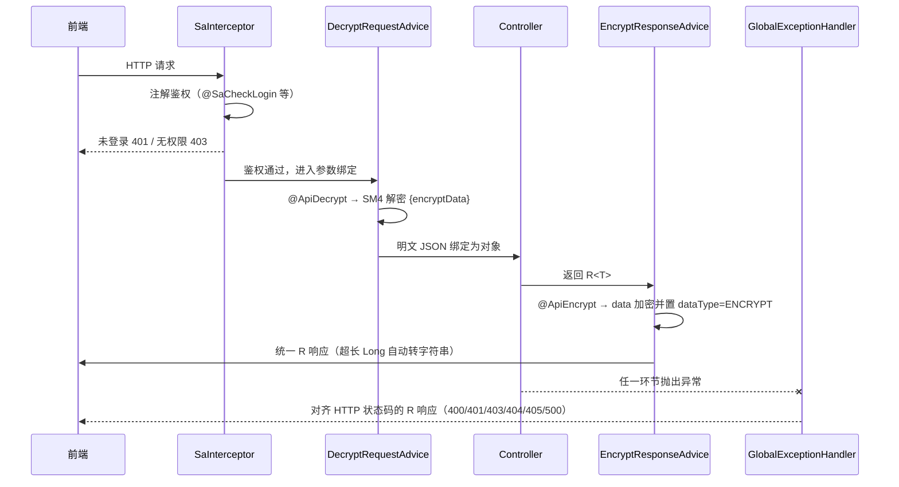

# mugsun-core

**中文** | [English](README_EN.md)


**Mugsun 低代码平台的公共内核**——全栈版本锁定（BOM）+ 可复用 starter，让业务工程「引入即得」统一响应、全局异常、接口加解密与审计基类，不在每个工程里重复造轮子。

版本兼容的坑在内核层一次性根治：MyBatis-Flex 传递的旧版 `mybatis-spring` 与 Spring Boot 3.5 / Spring 6.2 冲突（`NoSuchMethodError`），已在 BOM 与 starter 中显式覆盖为 3.0.5——**使用者无感**。

## 📦 模块总表

全仓仅四个模块，职责单一、边界清晰：

| 模块 | 职责 | 关键类 |
| --- | --- | --- |
| `mugsun-bom` | 全栈依赖版本锁定（含 `mybatis-spring` 3.0.5 显式覆盖） | —（pom） |
| `mugsun-core-tool` | 统一响应、统一状态码、业务异常与通用工具 | `R`、`ResultCode`、`ServiceException`、`ForbiddenException`、`TreeUtil` |
| `mugsun-starter-web` | Web 基座：全局异常、注解鉴权、接口加解密、Long 精度安全、Excel 读写 | `MugsunWebAutoConfiguration`、`GlobalExceptionHandler`、`SafeNumberModule`、`ApiCryptoService`、`ExcelUtil` |
| `mugsun-starter-mybatis` | 持久层基座：MyBatis-Flex 装配 + 实体基类 | `BaseEntity` |

## 🔀 模块关系



## 🚀 快速接入

在本仓根目录构建并安装到本地 Maven 仓库：

```bash
mvn clean install
```

然后在你的工程 `pom.xml` 中导入 BOM（版本号照抄本仓当前版本）：

```xml
<dependencyManagement>
	<dependencies>
		<dependency>
			<groupId>com.mugsun</groupId>
			<artifactId>mugsun-bom</artifactId>
			<version>0.0.1-SNAPSHOT</version>
			<type>pom</type>
			<scope>import</scope>
		</dependency>
	</dependencies>
</dependencyManagement>
```

按需引入 starter——**无需再写版本号**，全部由 BOM 接管：

```xml
<dependencies>
	<dependency>
		<groupId>com.mugsun</groupId>
		<artifactId>mugsun-starter-web</artifactId>
	</dependency>
	<dependency>
		<groupId>com.mugsun</groupId>
		<artifactId>mugsun-starter-mybatis</artifactId>
	</dependency>
</dependencies>
```

## ✨ 引入即得

- **统一响应 `R<T>` + `ResultCode`**：所有接口同一返回结构（`code/success/data/msg`），前端一套解析逻辑；预留 `dataType` 标记位承接加密响应。
- **全局异常处理**：业务异常不再裸奔 500——`ServiceException` 按业务码返回，未登录 401、越权 403、参数校验失败 400、资源不存在 404、请求方法不允许 405，HTTP 语义自动对齐；兜底 500 同步发布 `ErrorLogListener`，业务侧实现一个接口即可把错误日志落库。
- **注解鉴权**：`SaInterceptor` 自动注册并拦截 `/**`，`@SaCheckLogin` / `@SaCheckPermission` 等 Sa-Token 注解开箱即用。
- **接口国密加解密**：`@ApiDecrypt` / `@ApiEncrypt` 注解级开关，SM4-CBC + 每次请求随机 IV（密文非确定性，与前端 sm-crypto 互通）；密钥经 `mugsun.crypto.api-key` 外部注入，`mugsun.crypto.strict-keys=true` 时缺密钥直接拒绝启动，杜绝带默认密钥上生产。
- **Long 精度安全**：`SafeNumberModule` 随 Jackson 全局生效——超出 JS 安全整数范围（±2^53）的 `Long` / `BigInteger` 自动序列化为字符串，雪花主键不再在前端丢精度；范围内数值照常输出，不影响分页总数等常规字段。
- **实体基类 `BaseEntity`**：雪花主键（flexId）、数据库 `now()` 填充创建/更新时间、逻辑删除开箱即用；`sanitizeForInsert()` / `sanitizeForUpdate()` 在写入前剥离请求体伪造的审计字段——客户端输入一律不信任。
- **Excel 一行读写**：`ExcelUtil`（基于 FastExcel）——上传文件读为对象列表、对象列表导出 xlsx 触发下载，字段映射由 `@ExcelProperty` 声明。
- **树构建带环保护**：`TreeUtil.build()` 扁平列表转树，父指针成环的脏数据随环整体剔除，杜绝 `StackOverflow` 持续 500。

一次 HTTP 请求经过 starter 自动装配件的完整链路：



## 🧭 设计约定

- **Java 21+**：全仓以 `<java.version>21</java.version>` 编译。
- **Tab 缩进**：全仓统一 Tab，不混用空格。
- **显式自动装配**：starter 经 `META-INF/spring/org.springframework.boot.autoconfigure.AutoConfiguration.imports` 声明装配，不做组件扫描兜底——引入才生效，排除即彻底关闭。
- **可被覆盖**：所有装配 Bean 均带 `@ConditionalOnMissingBean`，业务工程声明同类型 Bean 即可整体替换默认实现。

## 🔗 与 mugsun-boot 的关系

本仓是内核，不直接运行；[mugsun-boot](../mugsun-boot)（[GitHub](https://github.com/mugsun/mugsun-boot)）是它的第一个消费者——以 `scope=import` 导入 `mugsun-bom` 后按需引入两个 starter，组装为可执行的单体后端。两仓平级放置于同一目录下即可联调。

## 📄 许可

[Apache License 2.0](LICENSE)
