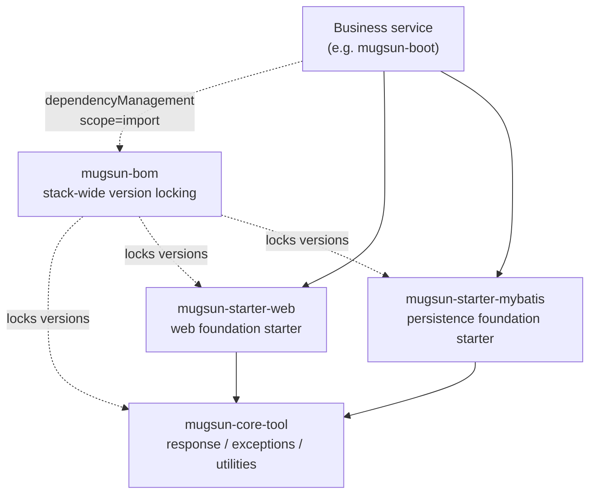
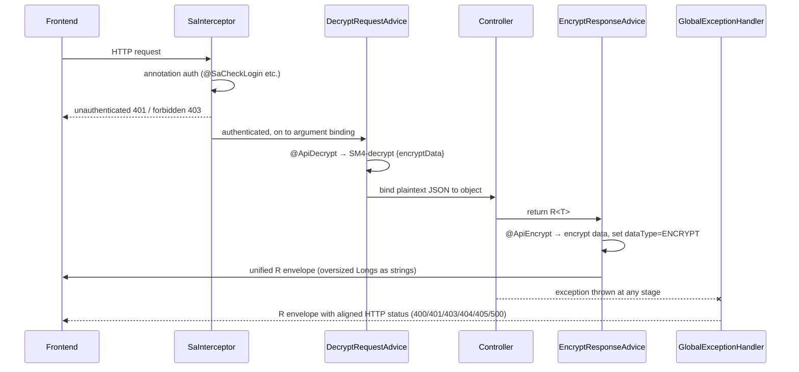

# mugsun-core

[中文](README.md) | **English**


**The shared kernel of the Mugsun low-code platform** — stack-wide version locking (BOM) plus reusable starters, so every business service gets a unified response envelope, global exception handling, API encryption, and an audited entity base class out of the box, instead of rebuilding them project by project.

Version-compatibility traps are fixed once, here in the kernel: MyBatis-Flex pulls in an older `mybatis-spring` that breaks on Spring Boot 3.5 / Spring 6.2 (`NoSuchMethodError`). It is explicitly overridden to 3.0.5 in the BOM and the starter — **consumers never feel it**.

## 📦 Modules

Just four modules, each with a single, well-defined job:

| Module | Responsibility | Key classes |
| --- | --- | --- |
| `mugsun-bom` | Stack-wide dependency version locking (including the explicit `mybatis-spring` 3.0.5 override) | — (pom) |
| `mugsun-core-tool` | Unified response envelope, result codes, business exceptions, and shared utilities | `R`, `ResultCode`, `ServiceException`, `ForbiddenException`, `TreeUtil` |
| `mugsun-starter-web` | Web foundation: global exception handling, annotation-based auth, API encryption, Long precision safety, Excel read/write | `MugsunWebAutoConfiguration`, `GlobalExceptionHandler`, `SafeNumberModule`, `ApiCryptoService`, `ExcelUtil` |
| `mugsun-starter-mybatis` | Persistence foundation: MyBatis-Flex wiring + entity base class | `BaseEntity` |

## 🔀 Module Graph



## 🚀 Getting Started

Build and install into your local Maven repository from the repo root:

```bash
mvn clean install
```

Then import the BOM in your project's `pom.xml` (use this repo's current version):

```xml
<dependencyManagement>
	<dependencies>
		<dependency>
			<groupId>com.mugsun</groupId>
			<artifactId>mugsun-bom</artifactId>
			<version>0.0.1-SNAPSHOT</version>
			<type>pom</type>
			<scope>import</scope>
		</dependency>
	</dependencies>
</dependencyManagement>
```

Pull in the starters you need — **no version tags required**, the BOM manages them all:

```xml
<dependencies>
	<dependency>
		<groupId>com.mugsun</groupId>
		<artifactId>mugsun-starter-web</artifactId>
	</dependency>
	<dependency>
		<groupId>com.mugsun</groupId>
		<artifactId>mugsun-starter-mybatis</artifactId>
	</dependency>
</dependencies>
```

## ✨ What You Get for Free

- **Unified response `R<T>` + `ResultCode`**: every endpoint returns the same envelope (`code/success/data/msg`), so the frontend needs exactly one parsing path; a reserved `dataType` flag carries encrypted responses.
- **Global exception handling**: business exceptions no longer surface as a bare 500 — `ServiceException` returns its business code, while unauthenticated maps to 401, forbidden to 403, validation failure to 400, missing resource to 404, and wrong method to 405, all aligned with HTTP semantics. The catch-all 500 also publishes to `ErrorLogListener`, so persisting error logs takes a single interface implementation on the business side.
- **Annotation-based auth**: `SaInterceptor` is auto-registered against `/**`, making Sa-Token annotations such as `@SaCheckLogin` and `@SaCheckPermission` work out of the box.
- **SM4 API encryption**: opt in per endpoint with `@ApiDecrypt` / `@ApiEncrypt`. SM4-CBC with a fresh random IV per request (non-deterministic ciphertext, interoperable with the frontend's sm-crypto). The key is injected externally via `mugsun.crypto.api-key`, and with `mugsun.crypto.strict-keys=true` the app refuses to start without one — no default key ever reaches production.
- **Long precision safety**: `SafeNumberModule` applies globally through Jackson — `Long` / `BigInteger` values beyond the JS safe-integer range (±2^53) serialize as strings, so snowflake IDs never lose precision in the frontend; in-range numbers stay numeric, keeping pagination totals and friends untouched.
- **`BaseEntity`**: snowflake primary key (flexId), database `now()`-filled create/update timestamps, and logical delete out of the box. `sanitizeForInsert()` / `sanitizeForUpdate()` strip forged audit fields from the request body before writes — client input is never trusted.
- **One-line Excel**: `ExcelUtil` (built on FastExcel) reads an uploaded file into an object list and exports an object list as an xlsx download, with field mapping declared via `@ExcelProperty`.
- **Cycle-safe tree building**: `TreeUtil.build()` turns a flat list into a tree; dirty data with cyclic parent pointers is dropped along with its cycle instead of blowing up into a `StackOverflowError` and a permanent 500.

The full path of one HTTP request through the starter's auto-configured components:



## 🧭 Design Conventions

- **Java 21+**: the whole repo compiles with `<java.version>21</java.version>`.
- **Tab indentation**: tabs everywhere, never mixed with spaces.
- **Explicit auto-configuration**: starters are wired through `META-INF/spring/org.springframework.boot.autoconfigure.AutoConfiguration.imports` — no component-scan fallback. They take effect only when included, and removing the dependency disables them completely.
- **Overridable by design**: every auto-configured bean carries `@ConditionalOnMissingBean`, so a business service can replace any default by declaring its own bean of the same type.

## 🔗 Relationship with mugsun-boot

This repo is the kernel — it doesn't run on its own. [mugsun-boot](../mugsun-boot) ([GitHub](https://github.com/curdx/mugsun-boot)) is its first consumer: it imports `mugsun-bom` with `scope=import`, adds the two starters, and assembles them into a runnable monolithic backend. Keep both repos side by side in the same directory for local development.

## 📄 License

[Apache License 2.0](LICENSE)
